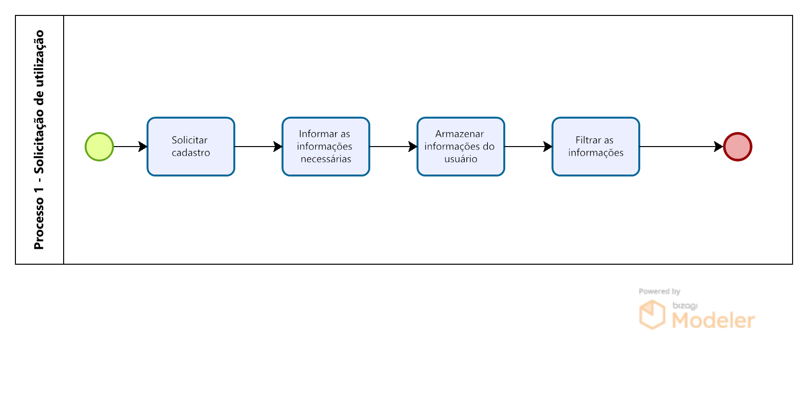
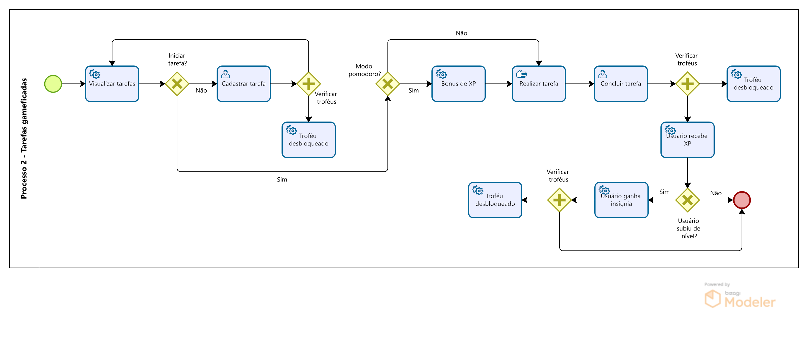
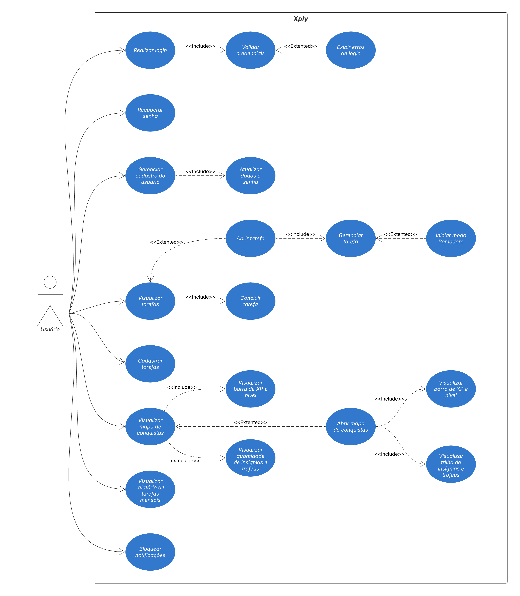
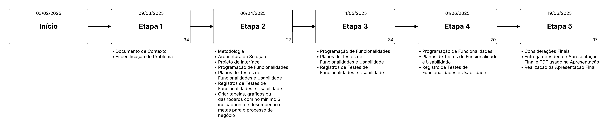
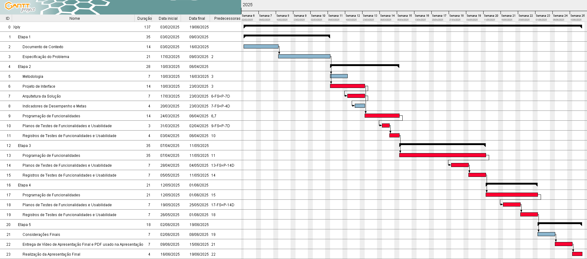
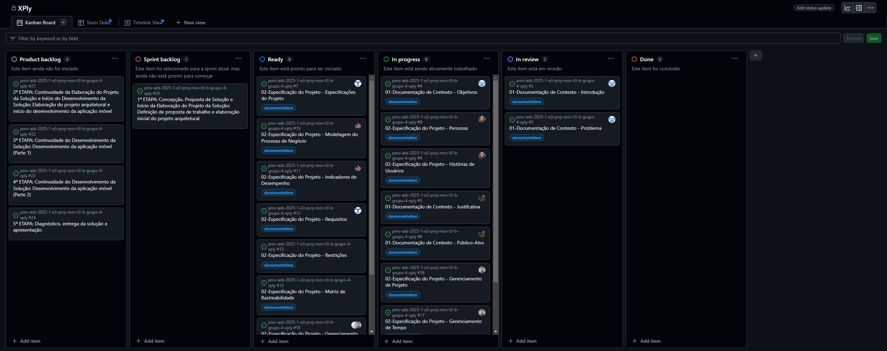

# Especificações do Projeto

Esta parte do documento visa fornecer uma base sólida para a especificação do projeto, utilizando técnicas e ferramentas
modernas e eficazes. A abordagem proposta garantirá que o aplicativo seja desenvolvido de forma alinhada com as
necessidades do público-alvo, atendendo tanto aos requisitos funcionais quanto aos não funcionais, e promovendo uma
experiência de usuário intuitiva e satisfatória.
Na especificação do projeto, foram utilizadas técnicas como a definição do diagrama de personas, histórias de usuários,
requisitos funcionais e não funcionais, além das restrições do projeto, que foram montados mediante imersão da equipe em
estudos.

## Personas

### 1. Mariana, 24 anos – Estudante universitária que trabalha

|  | **Nome:** Mariana, 24 anos                                                                                                                                                                                                                           |
|------------------------------|------------------------------------------------------------------------------------------------------------------------------------------------------------------------------------------------------------------------------------------------------|
| **Profissão**                | Estudante de engenharia e atendente em uma cafeteria                                                                                                                                                                                                 |
| **História**                 | Mariana trabalha meio período e estuda à noite. Seu dia é uma corrida contra o relógio, com pouco tempo para organizar as tarefas da faculdade e o trabalho. Muitas vezes, ela esquece prazos de trabalhos acadêmicos ou chega exausta para estudar. |
| **Motivação**                | Mariana quer equilibrar estudos e trabalho sem comprometer sua saúde mental e bem-estar.                                                                                                                                                             |
| **Desafio**                  | Falta de tempo para conciliar todas as responsabilidades, além de cansaço e dificuldade em manter o foco nos estudos depois do expediente.                                                                                                           |
| **Ferramenta atual**         | Usa Google Agenda e post-its espalhados, mas precisa de algo mais integrado e que a motive a cumprir pequenas metas diárias.                                                                                                                         |

---

### 2. Eduardo, 32 anos – Desenvolvedor de software

|  | **Nome:** Eduardo, 32 anos                                                                                                                                                                                                                               |
|------------------------------|----------------------------------------------------------------------------------------------------------------------------------------------------------------------------------------------------------------------------------------------------------|
| **Profissão**                | Programador Full Stack                                                                                                                                                                                                                                   |
| **História**                 | Eduardo trabalha remoto para uma startup e precisa gerenciar suas tarefas sem uma estrutura rígida de escritório. Ele já conhece metodologias ágeis, mas frequentemente se distrai com redes sociais e jogos e perde a noção do tempo em certas tarefas. |
| **Motivação**                | Quer melhorar sua produtividade no trabalho e reduzir o tempo perdido com distrações.                                                                                                                                                                    |
| **Desafio**                  | Tem dificuldade em medir quanto tempo gasta em cada tarefa e, às vezes, se sobrecarrega com prazos apertados.                                                                                                                                            |
| **Ferramenta atual**         | Usa Trello e Notion, mas sente falta de um sistema que o ajude a se manter mais engajado e focado ao longo do dia. O sistema de XP poderia incentivá-lo a manter um fluxo de trabalho produtivo.                                                         |

---

### 3. Cláudia, 40 anos – Empreendedora de pequena empresa

|  | **Nome:** Cláudia, 40 anos                                                                                                                                                                                                                            |
|------------------------------|-------------------------------------------------------------------------------------------------------------------------------------------------------------------------------------------------------------------------------------------------------|
| **Profissão**                | Dona de uma loja online de artesanato                                                                                                                                                                                                                 |
| **História**                 | Cláudia administra seu pequeno negócio sozinha, cuidando de tudo, desde a produção até as redes sociais e envio de pedidos. Como não tem uma equipe, precisa de uma forma eficiente de organizar suas tarefas diárias e acompanhar sua produtividade. |
| **Motivação**                | Melhorar sua organização e otimizar seu tempo para que consiga equilibrar o crescimento do negócio com sua vida pessoal.                                                                                                                              |
| **Desafio**                  | A sobrecarga de tarefas faz com que ela acabe esquecendo coisas importantes, como responder clientes ou renovar o estoque.                                                                                                                            |
| **Ferramenta atual**         | Anota as tarefas em cadernos físicos e usa um planner, mas sente falta de algo digital e dinâmico. A gamificação do app poderia ajudá-la a manter a motivação em meio às demandas do dia a dia.                                                       |

---

### 4. Felipe, 29 anos – Criador de conteúdo digital

|  | **Nome:** Felipe, 29 anos                                                                                                                                                                                                                                                                                |
|------------------------------|----------------------------------------------------------------------------------------------------------------------------------------------------------------------------------------------------------------------------------------------------------------------------------------------------------|
| **Profissão**                | Produtor de conteúdo para YouTube e redes sociais                                                                                                                                                                                                                                                        |
| **História**                 | Felipe trabalha sozinho criando vídeos para seu canal no YouTube e postagens para Instagram. Ele precisa planejar roteiros, gravar, editar e postar regularmente para manter o engajamento. Com tantas demandas, às vezes se sente desorganizado e tem dificuldade em manter uma frequência consistente. |
| **Motivação**                | Criar uma rotina mais estruturada para planejar e produzir conteúdo sem perder prazos ou comprometer a qualidade do trabalho.                                                                                                                                                                            |
| **Desafio**                  | A falta de um planejamento eficiente faz com que ele poste conteúdos de forma inconsistente e perca oportunidades de crescimento.                                                                                                                                                                        |
| **Ferramenta atual**         | Usa planilhas para organizar o cronograma de postagens, mas gostaria de algo mais interativo e motivador para ajudá-lo a cumprir metas e manter a consistência.                                                                                                                                          |

---

### 5. Gabriel Souza, 17 anos – Jovem Aprendiz

|  | **Nome:** Gabriel Souza, 17 anos                                                                                                                                                                                                             |
|------------------------------|----------------------------------------------------------------------------------------------------------------------------------------------------------------------------------------------------------------------------------------------|
| **Profissão**                | Jovem Aprendiz em uma empresa de tecnologia                                                                                                                                                                                                  |
| **História**                 | Gabriel trabalha meio período e estuda em um curso técnico de informática. Ele tem muitas responsabilidades e sente dificuldade em equilibrar estudo, trabalho e lazer. Às vezes, acaba esquecendo prazos importantes ou se sobrecarregando. |
| **Motivação**                | Organizar sua rotina para conciliar trabalho e estudo sem se sentir estressado.                                                                                                                                                              |
| **Desafio**                  | Dificuldade em priorizar tarefas, distrações no celular e falta de um método eficiente para organização.                                                                                                                                     |
| **Ferramenta atual**         | Usa Google Keep e anotações no celular, mas sente falta de algo que ajude a manter o foco e a produtividade.                                                                                                                                 |

---

## Histórias de Usuários

Com base na análise das personas foram identificadas as seguintes histórias de usuários:

| **EU COMO... `Persona`**             | **QUERO/PRECISO ... `Funcionalidade`**                          | **PARA ... `Motivo/Valor`**                                         |
|--------------------------------------|-----------------------------------------------------------------|---------------------------------------------------------------------|
| Estudante universitária que trabalha | Um sistema para organizar meus prazos e tarefas acadêmicas      | Conseguir conciliar trabalho e estudos sem me sobrecarregar         |
| Desenvolvedor de software            | Bloquear notificações e medir quanto tempo passo em cada tarefa | Manter o foco no trabalho e evitar distrações                       |
| Empreendedora de um pequeno negócio  | Criar e gerenciar listas de tarefas diárias                     | Organizar melhor minha rotina e evitar esquecer tarefas importantes |
| Criador de conteúdo digital          | Um espaço para planejar e acompanhar minhas postagens           | Manter um cronograma consistente e melhorar meu engajamento online  |
| Jovem Aprendiz que também estuda     | Um sistema para organizar minhas tarefas e compromissos         | Conseguir equilibrar trabalho, estudo e lazer sem atrasos           |

## Modelagem do Processo de Negócio

### Análise da Situação Atual

O simples questionamento de pessoas dizendo que "o tempo está voando", podem não ser tão simples assim, já que
aplicativos de entretenimento estudam como nosso cérebro funciona para conseguir literalmente prender seus usuários
dentro de seus aplicativos. Eles não estão se preocupando com a o tempo "perdido" de seus usuários. Hoje em dia as
pessoas perdem horas de seus dias sem nem perceber apenas consumindo algo que não é necessário para seu descanso ou
distrações necessárias para relaxar.

### Descrição Geral da Proposta

Sabendo disso decidimos desenvolver um aplicativo com mecanismos e dinâmicas de jogos sendo leve de distrações fúteis,
que consiga ajudar pessoas a organizarem melhor sua rotina conseguindo estipular horários para cada atividade editada
anteriormente pelo próprio usuário, depois de organizado sua rotina utilizaremos despertadores automáticos indicando
qual tarefa a pessoa deve fazer, para assim otimizar o desempenho e produtividade tanto em qualidade de vida quanto no
trabalhando.

### Processo 1 – Solicitação de ultilização

### Processo 2 – Planejamento da Rotina

### Propostas de melhorias
Automação de Notificações, enviar lembretes automáticos para tarefas em aberto, troféus próximos de serem desbloqueados e horários de descanso (como pausas do modo Pomodoro), evitando que o usuário se perca no fluxo diário.

Integração Simples de Agenda, permitir ao usuário importar compromissos de seu calendário pessoal (Google, Outlook, etc.) para que o XPly identifique oportunidades de aplicação do modo Pomodoro ou sugira intervalos de estudo/trabalho/lazer.

Ranking de Amigos ou Família, permitir a competição saudável entre contatos (seja por XP, troféus ou tarefas concluídas), estimulando engajamento e comparação de desempenhos.

## Indicadores de Desempenho

| Indicador                                               | Objetivo                                                             | Descrição                                                                  | Cálculo                                    | Fontes de Dados                           | Perspectivas                             |
|---------------------------------------------------------|----------------------------------------------------------------------|----------------------------------------------------------------------------|--------------------------------------------|-------------------------------------------|------------------------------------------|
| Taxa de tarefas concluídas | Acompanhar o volume de tarefas efetivamente concluídas                          | Percentual de tarefas concluídas em relação às tarefas criadas em um período específico     | (Nº de tarefas concluídas / nº de tarefas criadas) * 100 | Array de tarefas (AsyncStorage)             | Processos internos        |
| Uso do modo Pomodoro | Verificar o engajamento na técnica de foco (Pomodoro)               | Percentual de tarefas finalizadas com o Pomodoro ativado em relação ao total de tarefas concluídas | (Tarefas com Pomodoro / tarefas concluídas) * 100            | Array de tarefas (AsyncStorage)             | Usuário / engajamento     |
| Nível médio dos usuários     | Avaliar progresso médio em termos de gamificação        | Média do nível dos usuários ativos, refletindo quanto tempo dedicam e quantas tarefas realizam               | (Soma dos níveis / total de usuários ativos) | Array de usuários (AsyncStorage) | Crescimento / evolução          |
| Percentual de troféus desbloqueados | Medir a motivação/engajamento dos usuários via conquistas           | Percentual de troféus desbloqueados em relação aos troféus existentes        | (Troféus desbloqueados / troféus disponíveis) * 100  | Array de troféus (AsyncStorage)             | Usuário / engajamento |
| Retenção semanal | Analisar a regularidade de uso do app     | Percentual de usuários que usam o XPly mais de uma vez na semana em relação ao total de usuários | (Usuários ativos semana / total de usuários) * 100      | Log de uso local (AsyncStorage) / atividade             | Produto / aplicativo       |

## Requisitos

As tabelas que se seguem apresentam os requisitos funcionais e não funcionais que detalham o escopo do projeto. Para
determinar a prioridade de requisitos, aplicar uma técnica de priorização de requisitos e detalhar como a técnica foi
aplicada.

### Requisitos Funcionais

| ID     | Descrição do Requisito                                                                                                     | Prioridade |
|--------|----------------------------------------------------------------------------------------------------------------------------|------------|
| RF-001 | A aplicação deve permitir que o usuário realize o cadastro                                                                 | ALTA       |
| RF-002 | A aplicação deve permitir que o usuário gerencie o seu perfil, atualizando dados e senha                                   | ALTA       |
| RF-003 | A aplicação deve permitir que o usuário realize o login                                                                    | ALTA       |
| RF-004 | A aplicação deve permitir que o usuário recupere sua senha                                                                 | ALTA       |
| RF-005 | A aplicação deve permitir que o usuário visualize as tarefas, incluindo: abrir e gerenciar tarefas e iniciar modo pomodoro | ALTA       |
| RF-006 | A aplicação deve permitir que o usuário conclua as tarefas                                                                 | ALTA       |
| RF-007 | A aplicação deve permitir que o usuário visualize o mapa de conquistas                                                     | MÉDIA      |
| RF-008 | A aplicação deve permitir que o usuário visualize a barra de xp e nível                                                    | MÉDIA      |
| RF-009 | A aplicação deve permitir que o usuário visualize a quantidade de insígnias e troféus                                      | MÉDIA      |
| RF-010 | A aplicação deve permitir que o usuário abra o mapa de conquistas                                                          | BAIXA      |

### Requisitos não Funcionais

| ID      | Descrição do Requisito                                                                                                                          | Prioridade |
|---------|-------------------------------------------------------------------------------------------------------------------------------------------------|------------|
| RNF-001 | O sistema deve ser responsivo para rodar em um dispositivos móvel                                                                               | ALTA       |
| RNF-002 | O sistema Deve processar requisições do usuário em no máximo 3s                                                                                 | BAIXA      |
| RNF-003 | O sistema deve cumprir com a Lei Geral de Proteção de Dados (LGPD)                                                                              | ALTA       |
| RNF-004 | O sistema deve ser suportado em dispositivos iOS e Android                                                                                      | MÉDIA      |
| RNF-005 | O sistema deve ter uma interface do usuário deve ser intuitiva, permitindo que um usuário novato execute tarefas básicas em menos de 5 minutos. | MÉDIA      |
| RNF-006 | O sistema deve ser compatível com versões anteriores, garantindo que atualizações não quebrem funcionalidades existentes.                       | ALTA       |
| RNF-007 | O sistema deve atender aos critérios de acessibilidade                                                                                          | MÉDIA      |

## Restrições

O projeto está restrito pelos itens apresentados na tabela a seguir.

| ID | Restrição                                                                      |
|----|--------------------------------------------------------------------------------|
| 01 | O projeto deve ser entregue dentro do prazo e não pode ultrapassá-lo.          |
| 02 | A aplicação deve utilizar apenas React Native para o front-end.                |
| 03 | A interface da aplicação deverá ser intuitiva e responsiva.                    |
| 04 | O projeto deverá ser compatível com as versões mais recentes do Android e iOS. |
| 05 | O projeto deve ser desenvolvido apenas pelos membros da equipe.                |

## Diagrama de Casos de Uso

O diagrama de casos de uso abaixo ilustra as principais interações que os usuários poderão realizar dentro do nosso
aplicativo mobile. Nele, são representadas as funcionalidades disponíveis, os caminhos que podem ser seguidos e como
cada ação se conecta dentro do sistema. Esse modelo ajuda a visualizar de forma clara e objetiva o fluxo de uso do
aplicativo.

# Matriz de Rastreabilidade

A matriz de rastreabilidade é uma ferramenta usada para facilitar a visualização dos relacionamento entre requisitos e
outros artefatos ou objetos, permitindo a rastreabilidade entre os requisitos e os objetivos de negócio.

A matriz deve contemplar todos os elementos relevantes que fazem parte do sistema, conforme a figura meramente
ilustrativa apresentada a seguir.

| ID      | RF-001 | RF-002 | RF-003 | RF-004 | RF-005 | RF-006 | RF-007 | RF-008 | RF-009 | RF-010 | RNF-001 | RNF-002 | RNF-003 | RNF-004 | RNF-005 | RNF-006 | RNF-007 |
|---------|--------|--------|--------|--------|--------|--------|--------|--------|--------|--------|---------|---------|---------|---------|---------|---------|---------|
| RF-001  | X      | X      |        |        |        |        |        |        |        |        |         |         | X       |         |         |         |         |
| RF-002  |        | X      | X      |        |        |        |        |        |        |        |         |         | X       |         | X       |         |         |
| RF-003  |        |        | X      | X      |        |        |        |        |        |        |         | X       | X       |         |         |         |         |
| RF-004  |        |        |        | X      |        |        |        |        |        |        |         |         | X       |         |         |         |         |
| RF-005  |        |        |        |        | X      | X      |        |        |        |        |         | X       |         |         |         |         | X       |
| RF-006  |        |        |        |        |        | X      |        |        |        |        |         |         |         |         |         |         |         |
| RF-007  |        |        |        |        |        |        | X      |        |        | X      |         |         |         |         |         |         |         |
| RF-008  |        |        |        |        |        |        | X      | X      |        |        |         |         |         |         |         |         |         |
| RF-009  |        |        |        |        |        |        |        | X      | X      |        |         |         |         |         |         |         |         |
| RF-010  |        |        |        |        |        |        | X      |        |        | X      |         |         |         |         |         |         |         |
| RNF-001 |        |        |        |        |        |        |        |        |        |        | X       |         |         |         |         |         | X       |
| RNF-002 |        |        |        |        |        |        |        |        |        |        |         | X       |         |         |         |         |         |
| RNF-003 |        |        |        |        |        |        |        |        |        |        |         |         | X       |         |         |         |         |
| RNF-004 |        |        |        |        |        |        |        |        |        |        |         |         |         | X       |         |         |         |
| RNF-005 |        | X      |        |        |        |        |        |        |        |        |         |         |         |         | X       |         |         |
| RNF-006 |        |        |        |        |        |        |        |        |        |        |         |         |         |         |         | X       |         |
| RNF-007 |        |        |        |        |        |        |        |        |        |        | X       |         |         |         |         |         | X       |

# Gerenciamento de Projeto

O sucesso de um projeto está diretamente ligado à qualidade do seu gerenciamento. Para isso, seguiremos as diretrizes do
PMBOK v6, que abrange dez áreas essenciais: Integração, Escopo, Cronograma, Custos, Qualidade, Recursos, Comunicações,
Riscos, Aquisições e Partes Interessadas. Essas áreas estão interligadas e precisam ser gerenciadas de forma integrada
para evitar impactos negativos no projeto. Para centralizar o controle e otimizar a comunicação, utilizaremos as
ferramentas do GitHub, garantindo mais eficiência e organização ao longo do desenvolvimento.

## Gerenciamento de Tempo

Com o auxílio de diagramas bem organizados, é possível planejar e coordenar as tarefas do projeto, estabelecendo prazos
realistas para a conclusão de cada etapa. A utilização de Issues e Milestones no GitHub contribui para essa organização,
permitindo dividir o trabalho em pequenas tarefas e monitorar o andamento do projeto de forma prática e eficiente.

Para visualizar as
Milestones, [clique aqui](https://github.com/ICEI-PUC-Minas-PMV-ADS/pmv-ads-2025-1-e3-proj-mov-t3-b-grupo-4-xply/milestones).

Para acompanhar as datas de entrega e o progresso das tarefas do projeto, foi criado um Diagrama de Gantt, que oferece
uma visão clara do cronograma e ajuda no cumprimento dos prazos. Todo o acompanhamento é feito pelo painel do Projects
do GitHub, onde é possível visualizar as etapas principais, monitorar o andamento das atividades em tempo real e manter
a organização do projeto.

Para visualizar a Timeline
View, [clique aqui](https://github.com/orgs/ICEI-PUC-Minas-PMV-ADS/projects/1608/views/4?groupedBy%5BcolumnId%5D=Milestone).

## Gerenciamento de Equipe

O gerenciamento da equipe está sendo realizado pelo GitHub Projects, que oferece uma plataforma completa para organizar
tarefas, distribuir responsabilidades e acompanhar o progresso do projeto.

As atividades são organizadas no painel do Projects, utilizando a metodologia Kanban para facilitar o fluxo de trabalho.
As tarefas são distribuídas conforme a demanda de cada fase do projeto, permitindo que todos os membros da equipe
contribuam no front-end, back-end e também na documentação.

Através do painel Kanban, é possível visualizar o backlog, acompanhar o andamento das tarefas e realizar atualizações de
forma prática e transparente. Essa abordagem garante que a equipe mantenha o foco nos prazos estabelecidos e na
qualidade das entregas ao longo do projeto.

Para acessar o painel Kanban, [clique aqui](https://github.com/orgs/ICEI-PUC-Minas-PMV-ADS/projects/1608/views/2).

## Gestão de Orçamento

Para a elaboração do orçamento, foi considerado um período de 6 meses, com a contribuição de 6 stakeholders, a montagem de 6 estações de trabalho e a contratação de 6 planos de internet e VPNs.

| **ORÇAMENTO**        | **(R$)**       |
|----------------------|--------------|
| **Recursos humanos** | 192.000,00   |
| **Hardware**        | 45.000,00    |
| **Rede**            | 3.900,00     |
| **TOTAL**           | **240.900,00** |
