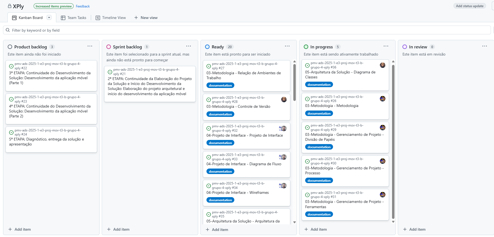
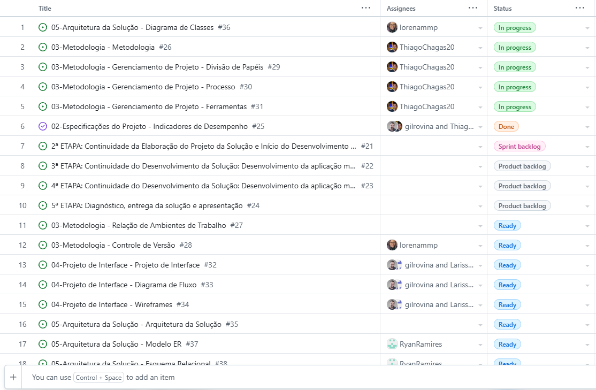

# Metodologia

Pré-requisitos: <a href="2-Especificação do Projeto.md"> Documentação de
Especificação</a>

Descreva aqui a metodologia de trabalho do grupo para atacar o problema. Definições sobre os ambiente de trabalho
utilizados pela equipe para desenvolver o projeto. Abrange a relação de ambientes utilizados, a estrutura para gestão do
código fonte, além da definição do processo e ferramenta através dos quais a equipe se organiza (Gestão de Times).

Utilizando a metodologia de desenvolvimento ágil como base para desemvolvimento SCRUM criado para agilizar o
desenvolvimento sem excesso de burocracia, desenvolveremos está aplicação totalmente remoto, por isso sempre temos que
manter contato rápido utilizando WhatsApp e para reuniões e conversas mais demoradas usamos o Discord, toda documentação
e códigos sendo armazenados em um repositório no GitHub.

## Relação de Ambientes de Trabalho

| AMBIENTE                          | PLATAFORMA   | LINK DE ACESSO                                                                                            |
|-----------------------------------|--------------|-----------------------------------------------------------------------------------------------------------|
| Repositório de código fonte       | GitHub       | https://github.com/ICEI-PUC-Minas-PMV-ADS/pmv-ads-2025-1-e3-proj-mov-t3-b-grupo-4-xply                    |
| Documentos do projeto             | GitHub       | https://github.com/ICEI-PUC-Minas-PMV-ADS/pmv-ads-2025-1-e3-proj-mov-t3-b-grupo-4-xply/tree/main/docs     |
| Projeto de interface e wireframes | Figma        | https://www.figma.com/design/nMxUDItIQUBDSgupmGTn4H/Wireframes-xply?node-id=20-2&p=f&t=HDXZ4X1vLCFYPzQG-0 |
| Gerenciamento do projeto          | GitHub       | https://github.com/orgs/ICEI-PUC-Minas-PMV-ADS/projects/1608                                              |
| Frameworks                        | React Native |
|Template da aplicação              |Figma         |https://www.figma.com/design/lBHODcE1ogF3yUpvSGHLQb/XPly?node-id=1461-167|
## Controle de Versão

Para garantir a organização e colaboração eficiente no desenvolvimento do projeto, utilizamos
o [Git](https://git-scm.com/) como sistema de controle de versão distribuído. O código-fonte será armazenado e
gerenciado através do [Github](https://github.com), proporcionando um ambiente seguro para versionamento, revisão de
código e integração contínua.

### Ferramenta de versionamento

Seguimos o fluxo de trabalho baseado no Gitflow, um modelo estruturado de branching que permite um desenvolvimento
organizado e previsível. O Gitflow se baseia em diferentes tipos de branches para separar as etapas do desenvolvimento,
garantindo um processo eficiente de entrega e manutenção.

#### Principais branches

- `main`: versão estável pronta para produção
- `develop`: versão de desenvolvimento do software onde novas funcionalidades serão integradas

#### Branches temporárias

- `feature/nome-da-feature`: versão estável pronta para produção
- `hotfix/nome-do-hotfix`: versão de desenvolvimento do software onde novas funcionalidades serão integradas

Quanto à gerência de issues, o projeto adota a seguinte convenção para
etiquetas:

- `documentation`: melhorias ou acréscimos à documentação
- `bug`: uma funcionalidade encontra-se com problemas
- `enhancement`: uma funcionalidade precisa ser melhorada
- `feature`: uma nova funcionalidade precisa ser introduzida

## Gerenciamento de Projeto

### Divisão de Papéis

Será utilizado pela equipe a metodologia ágil SCRUM para todo o desenvolvimento do projeto.

A divisão da equipe será:

- `SCRUM MASTER:`
    - Gilson Rodrigo Rovina Gonçalves;
- `PRODUCT OWNER:`
    - Thiago Gonçalves Chagas;
- `DESENVOLVEDORES:`
    - Ryan Ramires de Araújo;
    - Lucas Siqueira Ribeiro;
    - Lorena Marta Martiniana de Paula;
    - Larissa Moreira Tribst;
    - Davi de Assis Vilela.

> **Links Úteis**:
>
> - [11 Passos Essenciais para Implantar Scrum no seu Projeto](https://mindmaster.com.br/scrum-11-passos/)
> - [Scrum em 9 minutos](https://www.youtube.com/watch?v=XfvQWnRgxG0)
> - [Os papéis do Scrum e a verdade sobre cargos nessa técnica](https://www.atlassian.com/br/agile/scrum/roles)

## Processo

#### KAN BAN

 

#### TEAM TASKS

 

#### Detalhe da implementção da metodologia agil.

-
    1. _Sprint 1_

    - 1.1 _Planejamento_
    - 1.1.1 Documentação de contexto: estabelecer o contexto, o problema, os objetivos, a justificativa e o público-alvo
      do projeto.
    - 1.1.2 Especificação do projeto: estabelecer as personas, histórias de usuários, requisitos funcionais e não
      funcionais, além das restrições do projeto.
    - 1.2 _Execução_
    - 1.2.1 Responsável(s): toda a equipe contribuiu nessa sprint.
    - 1.2.2 Utilizamos GitHub para publicação da documentação, conseguimos entregar todas as tarefas planejadas.
    - 1.3 _Evidências_
    - 1.3.1 Documentação de
      contexto: https://github.com/ICEI-PUC-Minas-PMV-ADS/pmv-ads-2025-1-e3-proj-mov-t3-b-grupo-4-xply/blob/main/docs/01-Documenta%C3%A7%C3%A3o%20de%20Contexto.md
    - 1.3.2 Especificação do
      projeto: https://github.com/ICEI-PUC-Minas-PMV-ADS/pmv-ads-2025-1-e3-proj-mov-t3-b-grupo-4-xply/blob/main/docs/02-Especifica%C3%A7%C3%A3o%20do%20Projeto.md
    - 1.4 _Dificuldades_
        - 1.4.1 DIFICULDADES NESSA SPRINT (A PREENCHER)
           

-
    2. _Sprint 2_

    - 1.1 _Planejamento_
        - 2.1.1 Metodologia: definir a composição da equipe de trabalho e as relações de ambiente de trabalho.
        - 2.1.2 Projeto de Interface: definir o fluxo do usuário pelas telas do sistema e o protótipo interativo
          demonstrando as funcionalidades.
        - 2.1.3 Arquitetura da solução: definir as tecnologias que serão utilizadas no sistema.
    - 2.2 _Execução_
        - 2.2.1 Responsável(s) pela metodologia, arquitetura da solução e documentação: Thiago, Lorena, Ryan .
        - 2.2.2 Responsável(s) pelo projeto de interface e fluxo dos usuários: Gilson e Larissa.
        - 2.2.2 As ferramentas utilizadas foi o GitHub (A PREENCHER).
    - 2.3 _Evidências_
        - 2.3.1
          Metodologia: https://github.com/ICEI-PUC-Minas-PMV-ADS/pmv-ads-2025-1-e3-proj-mov-t3-b-grupo-4-xply/blob/main/docs/03-Metodologia.md
        - 2.3.2 Projeto de
          Interface: https://github.com/ICEI-PUC-Minas-PMV-ADS/pmv-ads-2025-1-e3-proj-mov-t3-b-grupo-4-xply/blob/main/docs/04-Projeto%20de%20Interface.md
        - 2.3.3 Arquitetura da
          solução: https://github.com/ICEI-PUC-Minas-PMV-ADS/pmv-ads-2025-1-e3-proj-mov-t3-b-grupo-4-xply/blob/main/docs/05-Arquitetura%20da%20Solu%C3%A7%C3%A3o.md
    - 2.4 _Dificuldades_
        - 2.4.1 DIFICULDADES NESSA SPRINT (A PREENCHER)

Coloque informações sobre detalhes da implementação do Scrum seguido pelo grupo. O grupo deverá fazer uso do recurso de
gerenciamento de projeto oferecido pelo GitHub, que permite acompanhar o andamento do projeto, a execução das tarefas e
o status de desenvolvimento da solução.

> **Links Úteis**:
>
> - [Planejamento e Gestáo Ágil de Projetos](https://pucminas.instructure.com/courses/87878/pages/unidade-2-tema-2-utilizacao-de-ferramentas-para-controle-de-versoes-de-software)
> - [Sobre quadros de projeto](https://docs.github.com/pt/issues/organizing-your-work-with-project-boards/managing-project-boards/about-project-boards)
> - [Project management, made simple](https://github.com/features/project-management/)
> - [Sobre quadros de projeto](https://docs.github.com/pt/github/managing-your-work-on-github/about-project-boards)
> - [Como criar Backlogs no Github](https://www.youtube.com/watch?v=RXEy6CFu9Hk)
> - [Tutorial Slack](https://slack.com/intl/en-br/)

### Ferramentas

As ferramentas empregadas no projeto são:

- `Editor de código:`.
- GitHub (pela excelente plataforma com mútiplas funções bem intuitivas e ilustradas que facilatam na organização e
  quualidade no desenvolvimento)

- `Ferramentas de comunicação:`
    - WhatsApp (aplicactivo muito bom para decisões e conversas rápidas)
    - Discord (pela praticidade e intuição para fazermos reuniões e conversas mais longas)
    - Teams (para fazer reunião com orientador)
- `Ferramentas de desenho de tela (_wireframing_):`
    - as
    - O editor de código foi escolhido porque ele possui uma integração com o sistema de versão. As ferramentas de
      comunicação utilizadas possuem integração semelhante e por isso foram selecionadas. Por fim, para criar diagramas
      utilizamos essa ferramenta por melhor captar as necessidades da nossa solução.

Liste quais ferramentas foram empregadas no desenvolvimento do projeto, justificando a escolha delas, sempre que
possível.

> **Possíveis Ferramentas que auxiliarão no gerenciamento**:
>
> - [Slack](https://slack.com/)
> - [Github](https://github.com/)
