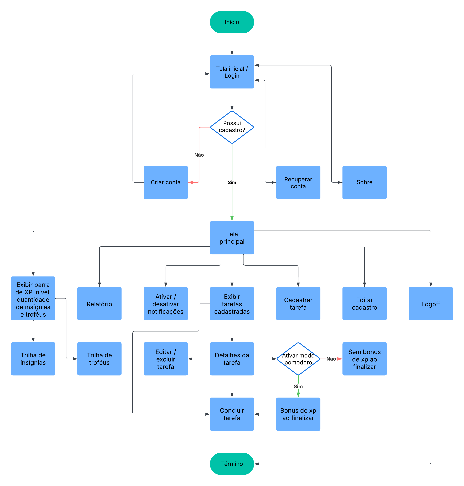

# Projeto de Interface

Visão geral da interação do usuário pelas telas do sistema e protótipo interativo das telas com as funcionalidades que fazem parte do sistema (wireframes).

## Diagrama de Fluxo

O Diagrama de Fluxo ilustra a navegação do usuário pelo sistema, mostrando a sequência de telas e interações dentro do aplicativo. Ele representa de forma visual como as principais funcionalidades estão conectadas, facilitando o entendimento da jornada do usuário e da usabilidade da aplicação.

## Wireframes

São protótipos usados em design de interface para sugerir a estrutura de um site web e seu relacionamentos entre suas páginas. Um wireframe web é uma ilustração semelhante do layout de elementos fundamentais na interface.

### Tela inicial

### Tela de cadastro

 

### Tela de login

### Tela de redefinição de senha

### Tela dos troféus

### Tela principal

### Tela de perfil

### Tela de Insígnia

### Tela de tarefas

 

