# Arquitetura da Solução

Pré-requisitos: <a href="3-Projeto de Interface.md"> Projeto de Interface</a>

Nesta seção, são apresentadas as definições adotadas para a estrutura da solução desenvolvida. São descritos os principais elementos que compõem o sistema e como eles se relacionam, com o objetivo de oferecer uma visão geral do funcionamento e da organização do projeto.

## Diagrama de Classes

O diagrama de classes ilustra graficamente como será a estrutura do software, e como cada uma das classes da sua estrutura estarão interligadas. Essas classes servem de modelo para materializar os objetos que executarão na memória.

```mermaid
classDiagram

    direction LR

    Usuario "1"-- "0..*" Tarefa
    Usuario "0..*"-- "0..*" Insignia
    Usuario "0..*"-- "0..*" Trofeu
    RelatorioMensal "1..*"-- "0..*" Tarefa

    class Usuario {
        -Integer id
        -String nome
        -String email
        -String senha
        -Integer nivel
        -Integer xp
        -List[Trofeu] trofeus
        -List[Insignia] insignias
        +validarUsuario()
        +recuperarSenha()
        +editarUsuario()
        +adicionarXp()
        +atualizarNivel()
    }

    class Tarefa {
        -Integer Id
        -Usuario usuario
        -String titulo
        -String descricao
        -Date dataCriacao
        -Date dataVencimento
        -String status
        +concluirTarefa()
        +editarTarefa()
        +visualizarTarefa()
    }
    class RelatorioMensal {
        -Usuario usuario
        -Integer mes
        -Integer ano
        -Integer tarefasConcluidas
        -Date tempoEmFoco
        +gerarRelatorio()
        +exibirRelatorio()
    }
    class Insignia {
        -Integer id
        -String nome
        -String descricao
        +desbloquearInsignia()
    }
    class Trofeu {
        -Integer id
        -String nome
        -String descricao
        +desbloquearTrofeu()
    }
```

## Modelo ER

O Modelo ER representa através de um diagrama como as entidades (coisas, objetos) se relacionam entre si na aplicação interativa.]

## Esquema Relacional

O Esquema Relacional corresponde à representação dos dados em tabelas juntamente com as restrições de integridade e chave primária.

## Modelo Físico

Entregar um arquivo banco.sql contendo os scripts de criação das tabelas do banco de dados. Este arquivo deverá ser incluído dentro da pasta src\bd.

## Tecnologias Utilizadas

As tecnologias adotadas neste projeto foram escolhidas com base na compatibilidade com os objetivos propostos, facilidade de uso e recursos oferecidos para garantir um desenvolvimento eficiente. A escolha do React Native se deu por ser a tecnologia abordada no curso, além de permitir a criação ágil de aplicações mobile multiplataforma. Ferramentas como o Expo e o JSON Server foram utilizadas para agilizar testes e simulações, enquanto o SQLite foi adotado para o armazenamento local de dados de forma leve e eficaz.

- **React Native**: Framework utilizado para desenvolvimento mobile multiplataforma com foco em performance e usabilidade.
- **NativeWind**: Biblioteca de estilização baseada no Tailwind CSS, voltada para aplicações React Native.
- **Expo**: Plataforma que simplifica o desenvolvimento e testes de aplicações React Native.
- **Visual Studio Code (VSCode)**: Editor leve e personalizável, utilizado para desenvolvimento do front-end.
- **JSON Server**: Ferramenta utilizada para simular uma API REST durante o desenvolvimento, permitindo testes rápidos com dados locais.
- **SQLite**: Banco de dados leve e local, utilizado para persistência de dados no dispositivo, garantindo funcionamento offline.

Abaixo uma imagem que descreve, de forma sucinta e simplicada, a forma como as diferentes tecnologias serão utilizadas ao longo do projeto.

## Hospedagem

O grupo pretende disponibilizar o projeto em ambiente online utilizando a plataforma Heroku. O Heroku permitirá que a aplicação esteja acessível para testes, demonstrações e validação por parte dos usuários, além de facilitar o processo de deploy durante o desenvolvimento.

> **Links Úteis**:
>
> - [Website com GitHub Pages](https://pages.github.com/)
> - [Programação colaborativa com Repl.it](https://repl.it/)
> - [Getting Started with Heroku](https://devcenter.heroku.com/start)
> - [Publicando Seu Site No Heroku](http://pythonclub.com.br/publicando-seu-hello-world-no-heroku.html)

## Qualidade de Software

A qualidade de software é um aspecto fundamental no desenvolvimento de sistemas, pois influencia diretamente a satisfação dos usuários e o sucesso do produto no mercado. Para avaliar e garantir essa qualidade, diversas normas e modelos foram desenvolvidos, destacando-se a ISO/IEC 9126, também conhecida no Brasil como NBR 13596.

### ISO/IEC 9126 (NBR 13596)

A ISO/IEC 9126 é uma norma internacional que define um modelo para avaliar a qualidade de produtos de software. Ela organiza a qualidade em seis características principais, cada uma subdividida em subcaracterísticas específicas. A seguir, apresenta-se uma visão geral dessas características e subcaracterísticas:

| **Característica** | **Subcaracterísticas**                                                                                                                                                                                                                                                                                                                                                                                                                                                                                         |
| ------------------ | -------------------------------------------------------------------------------------------------------------------------------------------------------------------------------------------------------------------------------------------------------------------------------------------------------------------------------------------------------------------------------------------------------------------------------------------------------------------------------------------------------------- |
| **Funcionalidade** | - **Adequação**: capacidade de o software fornecer um conjunto apropriado de funções para tarefas especificadas.   - **Acurácia**: capacidade de fornecer resultados ou efeitos corretos ou conforme acordados.   - **Interoperabilidade**: capacidade de interagir com sistemas especificados.   - **Conformidade**: aderência a normas, convenções ou regulamentos relacionados à funcionalidade.   - **Segurança de acesso**: capacidade de prevenir acesso não autorizado a programas e dados. |
| **Confiabilidade** | - **Maturidade**: frequência de falhas no software.   - **Tolerância a falhas**: capacidade de manter um nível especificado de desempenho em caso de falhas de software ou violações de sua interface especificada.   - **Recuperabilidade**: capacidade de restabelecer seu nível de desempenho e recuperar os dados afetados em caso de falha.   - **Conformidade**: aderência a normas ou convenções relacionadas à confiabilidade.                                                                |
| **Usabilidade**    | - **Inteligibilidade**: esforço necessário para o usuário reconhecer os conceitos lógicos e sua aplicação.   - **Apreensibilidade**: esforço necessário para o usuário aprender a aplicação.   - **Operacionalidade**: esforço necessário para o usuário operar e controlar a aplicação.   - **Atratividade**: capacidade do software ser atraente ao usuário.                                                                                                                                        |

### Garantia da Qualidade no Projeto

Para garantir a qualidade de software no nosso projeto, adotamos boas práticas de engenharia de software em todas as etapas do desenvolvimento. Isso inclui a definição de requisitos, revisão de código, aplicação de testes de usabilidade, e uso de métricas para avaliar aspectos como desempenho e confiabilidade. Também utilizaremos versionamento com Git, integração contínua (CI), e seguiremos metodologias ágeis como o Scrum.
