# Template Padrão da Aplicação

Layout base da aplicação que será aplicado em todas as telas, definindo a identidade visual por meio da escolha de tipografia, ícones e elementos gráficos padronizados.

## Logo
O logotipo do XPly traz uma identidade marcante e com estilo inspirado no universo dos games. A tipografia em negrito e com traços angulados transmite energia e progresso. O degradê entre rosa e azul representa criatividade, dinamismo e tecnologia. O “XP” se destaca como símbolo de evolução e experiência, enquanto o “ly” adiciona leveza, reforçando a proposta do app de transformar produtividade em algo mais envolvente.

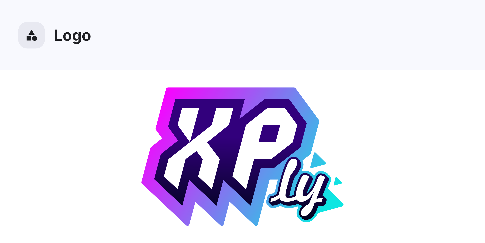

## Cores
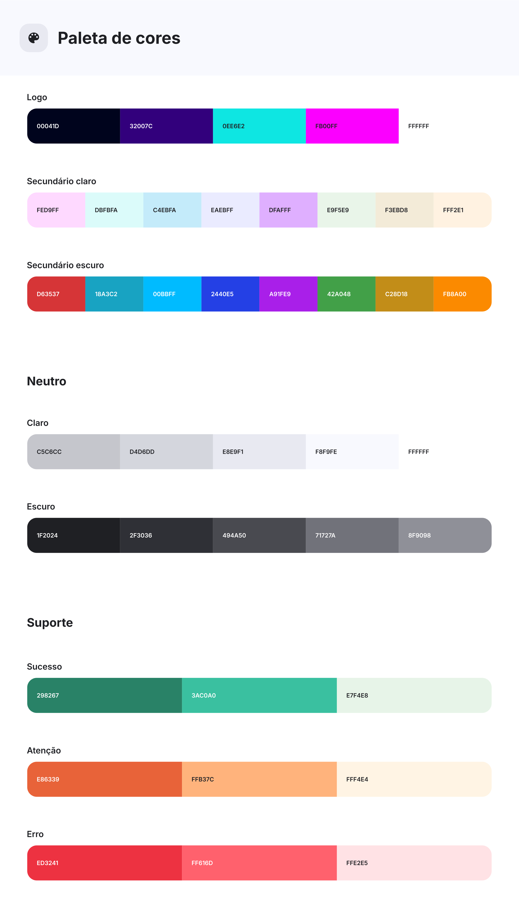

## Tipografia e iconografia
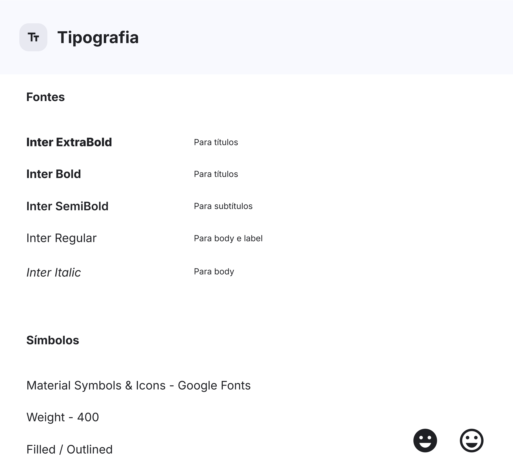

## Template da aplicação
Os modelos foram criados com foco em uma experiência intuitiva, priorizando a simplicidade, a clareza das ações e o uso de elementos visuais que reforcem a proposta gamificada do app:

##### Index / Login
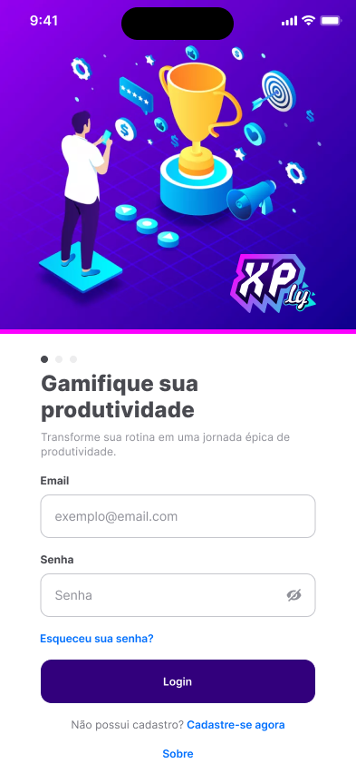

##### Cadastro
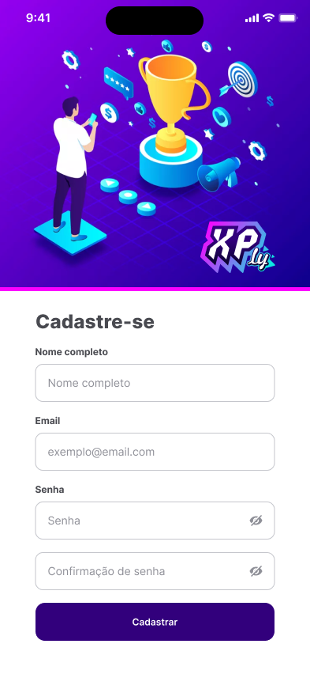

##### Redefinir senha

##### Sobre
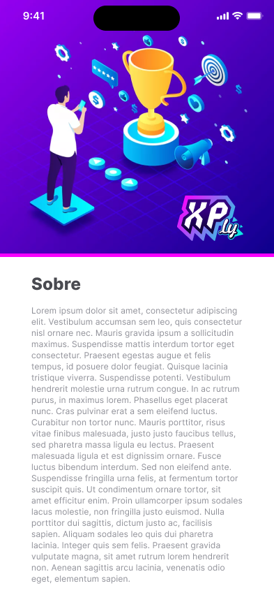

##### Principal
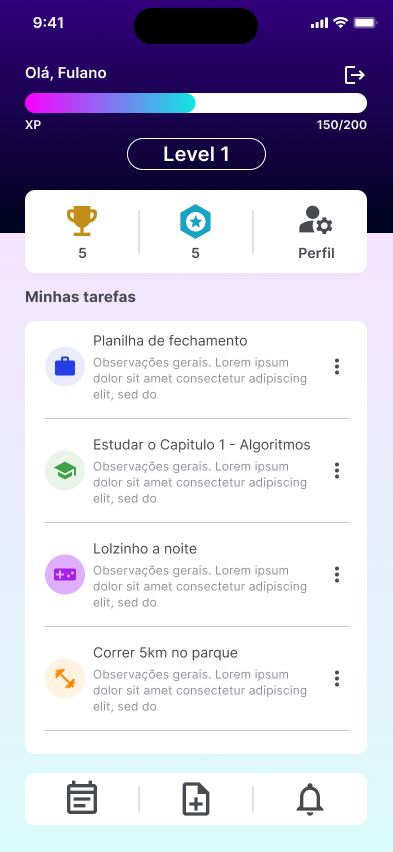

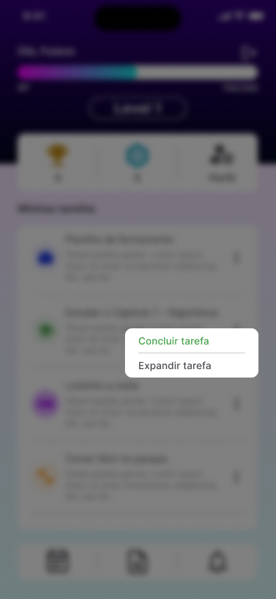

##### Relatório
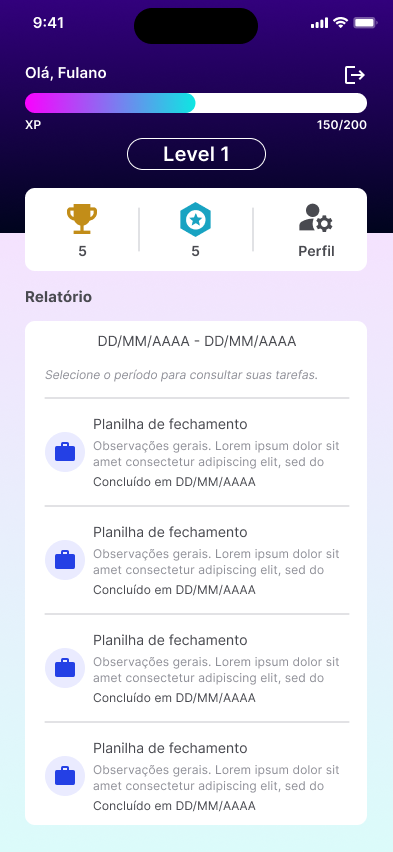

##### Troféus
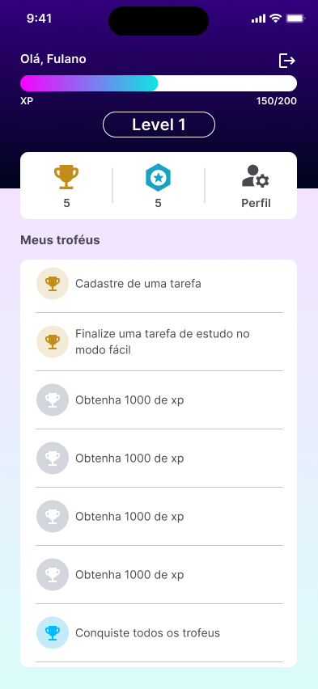

##### Insígnias
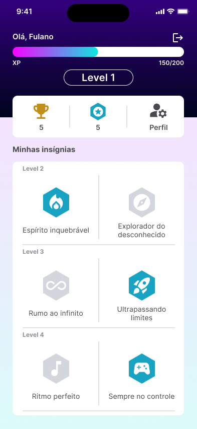

##### Perfil
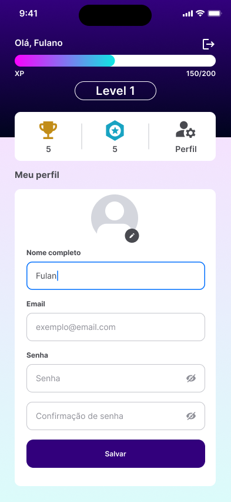

##### Cadastro de tarefa

##### Detalhes da tarefa
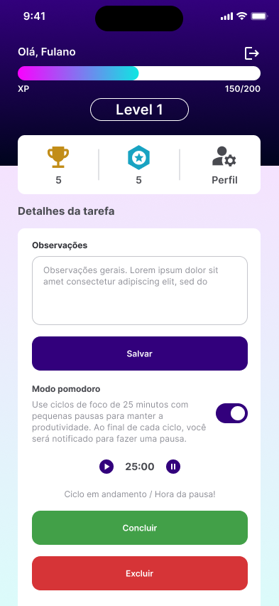
