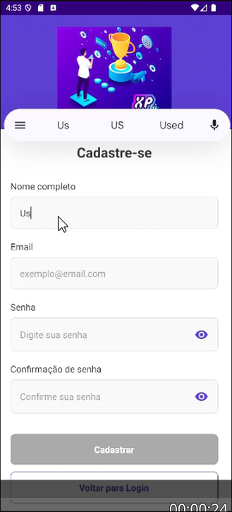

# Registro de Testes de Software

* Documento com o registro dos testes de software aplicados ao sistema pela equipe conforme o plano previamente
  estabelecido.

## Caso de teste CT-001:

* **Requisito Associado:** RF-001 - A aplicação deve permitir que o usuário realize o cadastro
* **Descrição do Teste:** Foi verificado se o sistema permite o registro integral de novos usuários conforme os campos
  dispostos para preenchimento
* **Resultado Esperado:** Formulários devem aceitar apenas dados válidos e indicar campos obrigatórios

### Evidência do teste realizado:

## Caso de teste CT-003:

* **Requisito Associado:** RF-003 - A aplicação deve permitir que o usuário realize o login no sistema
* **Descrição do Teste:** Foi verificada a funcionalidade de login
* **Resultado Esperado**: Sistema deve autenticar credenciais e bloquear acessos inválidos

## Avaliação:
Serão realizadas mudanças relativas ao idioma em que as mensagens de erro do sistema são
  dispostas ao usuário conforme feedback colhido durante a finalização dos testes de usabilidade

## Conclusão:

Os testes realizados, **limitados às funcionalidades de cadastro (CT-001) e login (CT-003)**, apresentaram resultados
satisfatórios levando em consideração a etapa inicial de desenvolvimento da aplicação. Posteriormente, deverão ser
desenvolvidas as demais funcionalidades do sistema e aplicadas melhorias em referência as funcionalidades já
desenvolvidas e testadas 